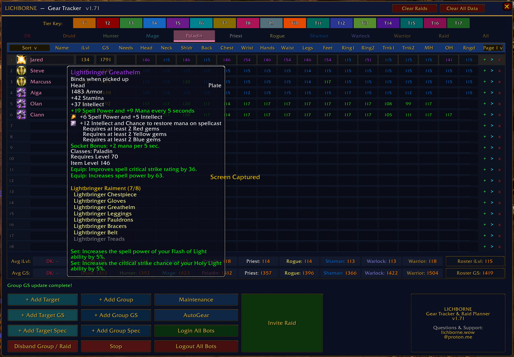
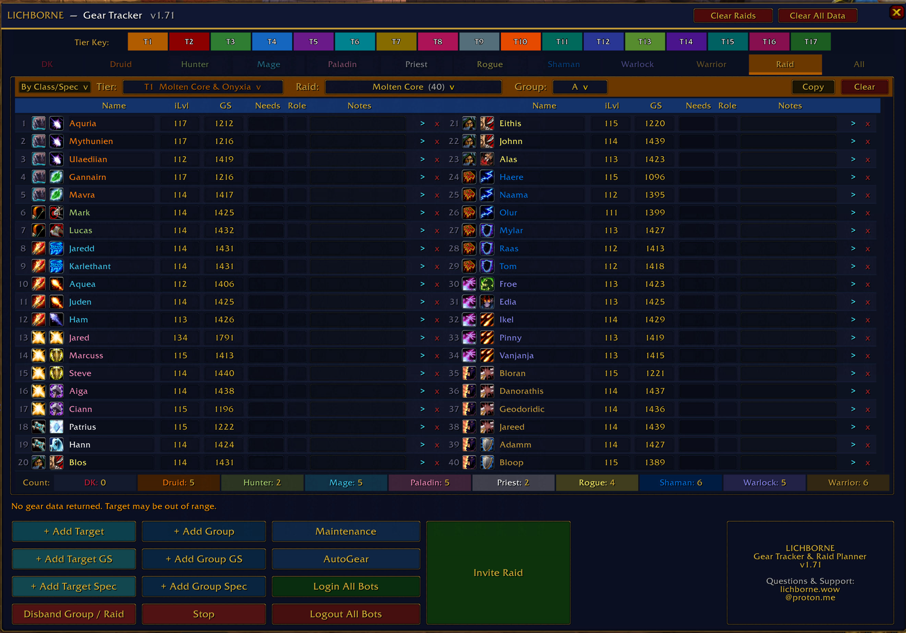
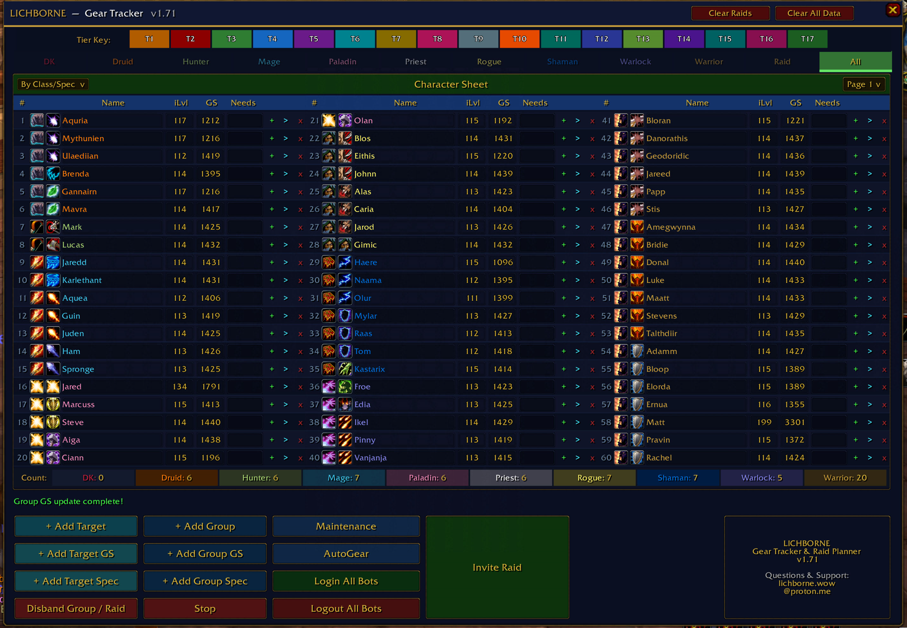

# LICHBORNE — Gear Tracker

**A World of Warcraft WotLK 3.3.5a Addon for AzerothCore Private Servers**

LichborneTracker is a playerbot/raid management tool built specifically for AzerothCore private servers.  It tracks gear, GearScore, and specs for your entire roster across all 10 classes, lets you build and manage raid rosters, and invites your playerbots directly from the addon.

**Version 1.74**

---

## Screenshots

---

## Recent Changes

- **Minimap icon fix (improved)** — Added a native fallback minimap button based on DBM's implementation that activates automatically when LibDBIcon is unavailable, guaranteeing the icon appears on every machine regardless of lib compatibility. Bundled libs updated to DBM-compatible versions.
- **Minimap icon updated** — The minimap button now uses a book texture for a cleaner look.
- **T0 raid dropdown crash fix** — Fixed a nil error when opening the raid dropdown while Tier 0 (5-Man) was selected.
- **Add Group scan compatibility fix** — Group scan buttons now bind the local scan-state helper correctly on 3.3.5a, preventing `SetScanActive` nil errors reported through addon hook stacks such as BugSack or ElvUI.
- **Addon load compatibility fix** — Bundled `CallbackHandler-1.0` is now loaded before `LibDataBroker-1.1`, and startup no longer hard-fails if the minimap broker stack is unavailable.
- **3.3.5a-safe UI handlers** — Replaced fragile implicit handler globals like `this` and `arg1` with explicit script arguments to reduce conflicts with other addons.
- **Gear Score average bar in Class tabs** — Each class tab now displays an average GearScore bar alongside the existing average iLvl bar.
- **Item quality colors on gear slots** — Gear slot icons in the class tab are now color-coded to match WoW item quality (grey, white, green, blue, purple, orange).
- **Buttons disabled during scans** — Get Gear Score, Get Group Spec, and Invite Raid buttons are now disabled while a scan or invite sequence is running to prevent conflicts.
- **Visual updates and fixes** — General polish and layout corrections across tabs.
- **Separate iLvl and GS columns** — The old GS field is now labeled iLvl, and a new GS column tracks actual GearScore.
- **Actual GearScore calculation** — Inspect now calculates WotLK-style GearScore from equipped gear instead of reusing average item level.
- **Shared score syncing** — iLvl and GS stay in sync across Class, All, and Raid tabs, including copy/paste and drag reorder paths.
- **All tab action fixes** — Delete, add-to-group, and add-to-raid actions now operate on the visible character.
- **Deletion cleanup** — Removing a character also clears matching needs and raid roster references.
- **Invite flow fixes** — Invite buttons now reflect whether you are inviting a raid, inviting a group, or have an active invite run.
- **Raid size normalization** — Raid rosters now initialize and clamp correctly for the selected size.
- **Need Box** — Up to 2 needed gear slots per character, editable across Class, All, and Raid tabs.

---

## Features

### Class Tabs

Each of the 10 playable classes has its own tab with up to 54 roster slots across 3 pages. Each character row tracks:

- Row number — muted grey, turns gold on hover
- Spec icon — auto-detected from talent inspection
- Name — editable, colored by class
- iLvl — average equipped item level calculated via inspect
- Gear Score — actual WotLK-style GearScore calculated from inspected gear, colored by item quality
- **Need Box** — up to 2 gear slots marked as needed, shown as slot icons
- 17 gear slots — Head, Neck, Shoulders, Back, Chest, Wrists, Hands, Waist, Legs, Feet, Ring 1, Ring 2, Trinket 1, Trinket 2, Main Hand, Off Hand, Ranged
- Add to Raid (+) and Invite to Group (>) buttons per row
- Hover any gear slot to see the full item tooltip

### Bottom Controls (Class Tabs)

- **+ Add Target** — Inspects your current target and adds them
- **+ Add Group** — Bulk-adds all group/raid members
- **+ Add Target/Group GS** — Refreshes both iLvl and GS from inspect (does not affect spec); button disabled during active scan
- **+ Add Target/Group Spec** — Reads talent spec (does not affect GS); button disabled during active scan
- **Stop** — Cancels a running GS or Spec scan
- **Maintenance** — Sends maintenance to group chat
- **AutoGear** — Sends autogear to group chat
- **Login/Logout All Bots** — .playerbots bot add/remove *
- **Disband Group / Raid** — Kicks all members then leaves. Requires confirmation
- **Invite Raid / Stop Invite** — Visible on all tabs; disabled while invite sequence is running

### Summary Bars

- **Avg bar** — average tracked item level per class
- **GS bar** — average GearScore per class
- **Count bar** — total characters per class

---

## Need Box

Per-character gear slot wishlist, accessible from all tabs.

- 15 selectable slots: Head, Neck, Shoulders, Back, Chest, Wrists, Hands, Waist, Legs, Feet, Ring, Trinket, Main Hand, Off Hand, Ranged
- Max 2 needs per character
- Click a Need Box cell to open the picker popup
- Left-click a slot icon to mark as needed, right-click to remove
- Once at max (2), remaining slots are dimmed
- Right-click the Need Box cell itself to clear all needs for that character
- Changes sync instantly across Class, All, and Raid tabs
- Stored in LichborneTrackerDB.needs per character name

---

## Raid Tab

Up to 40 slots across two columns. Each slot shows class icon, spec icon, name, iLvl, GS, needs, role, notes, and delete button.

### Raid Controls

- **Sort** — By Name, Class/Spec, or Gear Score using the real GS value
- **Tier / Raid / Group dropdowns** — Tier color matches the progression tiers from the Individual Progression module for AzerothCore
- **Copy** — Copies current roster to session clipboard
- **Paste** — Prompts confirmation, pastes into destination, disappears after one use
- **Clear** — Clears roster with confirmation

### Copy / Paste

1. Navigate to source roster and click **Copy**
2. Navigate to destination and click **Paste**
3. Confirm the prompt
4. Status bar shows "Roster copied!"

Clipboard is session-only. Paste respects destination raid size.

### Invite Raid

Automatically logs out old bots, leaves party, converts to raid, and invites all roster members via .playerbots bot add. The Invite Raid button is disabled while the sequence is running.

---

## Character Sheet (All Tab)

Master view of all tracked characters across all classes — 3 columns of 20 rows (60 per page, 180 total).

- Groups A, B, C for organizing characters
- Sort by Name, Class/Spec, or Gear Score using the real GS value
- Need Box column editable per row
- Add to Raid and Invite to Group buttons per row
- Delete characters directly
- Count bar shows totals across all pages

---

## Tier Key

Color-coded tier reference bar at the top of the frame, aligned with the Individual Progression module for AzerothCore. Hover any swatch to see the full tier name and associated raids.

---

## Installation

### Option 1 — Git Clone (recommended, stays updated)

Navigate to your AddOns folder and run:

    git clone https://github.com/Lichborne-AC/LichBorne-Gear-Tracker.git LichborneTracker

To update later just run `git pull` inside the LichborneTracker folder.

### Option 2 — Manual Install

1. Download the latest zip from the Releases page
2. Extract and drag the LichborneTracker folder into:

    World of Warcraft/Interface/AddOns/

3. Launch WoW and type `/lichborne` or click the minimap book icon

**Requirements:** WoW 3.3.5a (WotLK) | AzerothCore | Playerbot module

---

## How To Use

### First Time Setup

1. Open the tracker with `/lichborne` or click the minimap book icon
2. Target a character and click + Add Target
3. Or get everyone at once: group up and click + Add Group

### Tracking Gear

- **+ Add Target/Group GS** — updates both iLvl and GS without touching spec
- Hover any gear slot to see the full item tooltip
- Gear slot colors reflect WoW item quality

### Building a Raid Roster

1. Switch to Raid tab and select tier and raid
2. Use + on any character row to add them
3. Assign roles and notes
4. Click Invite Raid

### Marking Needs

1. Click any Need Box cell on the Class, All, or Raid tab
2. Select up to 2 slot icons from the picker
3. Right-click a slot to remove it, or right-click the cell to clear all

### Copying a Roster

1. Navigate to source roster and click Copy
2. Switch to destination and click Paste then confirm

### Disbanding

Disband Group / Raid kicks every member via .playerbots bot remove, waits, then calls LeaveParty(). Requires confirmation.

---

## Data & Saved Variables

Stored under LichborneTrackerDB and LichborneMinimapIconDB per WoW account.

| Key | Contents |
| --- | --- |
| rows | All tracked characters, item levels, and GearScore data |
| allGroups | All tab group assignments (A/B/C) |
| raidRosters | Raid rosters keyed by raid name + group |
| needs | Gear needs per character |
| raidName | Currently selected raid |
| raidTier | Currently selected tier |
| raidGroup | Currently selected group (A/B/C) |

**Clear All Data** permanently deletes all tracked characters, gear, rosters, and needs data.

---

## Known Limitations

- Inspect requires target within ~28 yards
- GearScore depends on the inspect data returned by the server for the target's equipped items
- NotifyInspect() is rate-limited — bulk scans space out automatically
- Playerbot commands sent via SAY chat — requires bot ownership
- Roster clipboard is session-only (lost on /reload)

---

## Slash Commands

| Command | Action |
| --- | --- |
| /lichborne | Toggle the tracker window |
| /lbt | Toggle the tracker window (short alias) |

---

## Credits

Built for the Lichborne AzerothCore private server.

Special thanks to: **Dohtt**, **Scarecr0w12** — TheCGN.net, **Dreathean**, **Revision**, **crow**, and **ScoobyPwnsOnU** for feature suggestions, testing, and support.

**Questions & Support:** lichborne.wow@proton.me

---

## Compatibility

WoW 3.3.5a (build 12340) | AzerothCore | Playerbot Module
